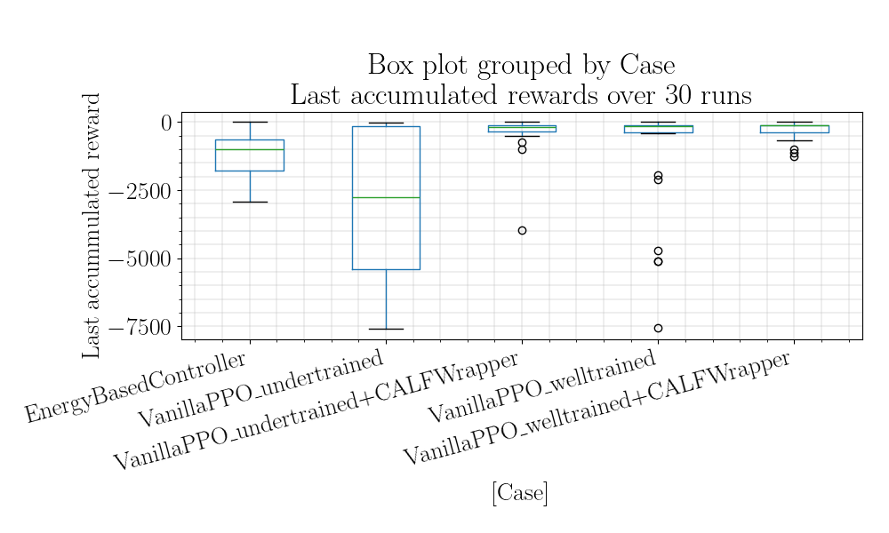

# PPO with CALFWrapper evaluation

> [!IMPORTANT]  
> It's supposed that this subfolder is your working directory: 
> do not forget to apply in your terminal `cd run/ppo_pendulum_calf_wrapper_eval`

## Idea
We want to train a PPO agent on the standard pendulum environment and evaluate it with the CALFWrapper on Pendulum environment.

## Aim
Show that PPO evaluated with CALFWrapper is better than PPO without CALFWrapper evaluated on the pendulum environment.

### Train PPO and Evaluate PPO (Pendulum Environment) with CALF Wrapper

#### Training

To train a PPO agent on the standard pendulum environment:

```bash
python pendulum_ppo.py
```

During the training, checkpoints are stored by a callback each 1000 steps in to the this relative folder `./artifact/checkpoints/`.

##### Checkpoints

The checkpoints have following formats:
```
# Checkpoints stored each 1000 steps
./artifacts/checkpoints/ppo_pendulum_<step-number>_steps.zip 

# The best checkpoint after training
./artifacts/checkpoints/ppo_pendulum.zip 
```

##### Configurations

The following configuration was used:

```
total_timesteps = 500000

ppo_hyperparams = {
        "learning_rate": 5e-4,
        "n_steps": 4000,
        "batch_size": 200,
        "gamma": 0.98,
        "gae_lambda": 0.9,
        "clip_range": 0.05,
        "learning_rate": get_linear_fn(5e-4, 1e-6, total_timesteps*2),
        "use_sde": True,
        "sde_sample_freq": 4,
    }
```

#### Evaluation
After training, to evaluate a PPO agent on the normal pendulum environment:

```shell
python pendulum_ppo.py --notrain
```

Using the same training checkpouint, to evaluate a PPO agent on the pendulum environment + CALF Wrapper:

```shell
python pendulum_ppo_eval_calf_wrapper.py --notrain
```

The following CALF configuration was used:
```python
calf_hyperparams = {
    "calf_decay_rate": 0.01,
    "initial_relax_prob": 0.5,
    "relax_prob_base_step_factor": .95,
    "relax_prob_episode_factor": 0.
}
```

And CALF relax probability **exponentially decays** over time steps.

#### Options

Option | Description |
| ----- |  ----- |
| `--notrain` | Skip training and only run evaluation |
| `--seed` | Random seed to initialize initial state of the pendulum |
| `--loadstep` | Choose the checkpoint step want to load in the evaluation phase (i.e. 200000, 201000 500000) |
| `--console` | Run in console-only mode (no graphical outputs) |
| `--log` | Enable logging and printing of simulation data |

#### Evaluation scripts
To evaluate PPO with and without CALF wrapper (using Pendulum environment), there are 5 evaluation scenario should be run:
- With standard Pedulum environment
  - Welled-trained PPO is evaluated
  - Under-trained PPO is evaluated
- With standard Pedulum environment + CALF Wrapper
  - Welled-trained PPO is evaluated 
  - Under-trained PPO is evaluated
- Traditional controller algorithm (as a reference, and used as CALF fallback controller as well) is evaluated

To be specific, we use the checkpoint at:
- 500000th step as the well-trained checkpoint
- 200000th step as the under-trained checkpoint
  
Use this pre-defined script:
```shell
source evaluation.sh
```
Or to run 30 seeds for each case with corresponding initial states:
```shell
source evaluation_loop.sh
```

#### Results
All the results are calculated using the [Jupyter Notebook](./analysis/ppo_pendulum_calf_wrapper_eval/analysis.ipynb) 

| Case                                |   ('last_accumulated_reward', 'std') |   ('last_accumulated_reward', 'var') |   ('last_accumulated_reward', 'min') |   ('last_accumulated_reward', 'mean') |   ('last_accumulated_reward', 'median') |   ('last_accumulated_reward', 'max') |
|:------------------------------------|-------------------------------------:|-------------------------------------:|-------------------------------------:|--------------------------------------:|----------------------------------------:|-------------------------------------:|
| EnergyBasedController               |                              824.157 |                     679234           |                             -2935.31 |                             -1167.03  |                                -996.113 |                           -7.14436   |
| VanillaPPO_undertrained             |                             2600.24  |                          6.76126e+06 |                             -7583.16 |                             -2925.43  |                               -2754.4   |                          -13.2409    |
| VanillaPPO_undertrained+CALFWrapper |                              717.357 |                     514601           |                             -3967.2  |                              -368.948 |                                -194.519 |                           -7.2526    |
| VanillaPPO_welltrained              |                             1945.61  |                          3.78538e+06 |                             -7545.64 |                             -1020.94  |                                -146.102 |                           -0.0943505 |
| VanillaPPO_welltrained+CALFWrapper  |                              340.508 |                     115946           |                             -1249.81 |                              -308.321 |                                -134.906 |                           -6.92786   |


