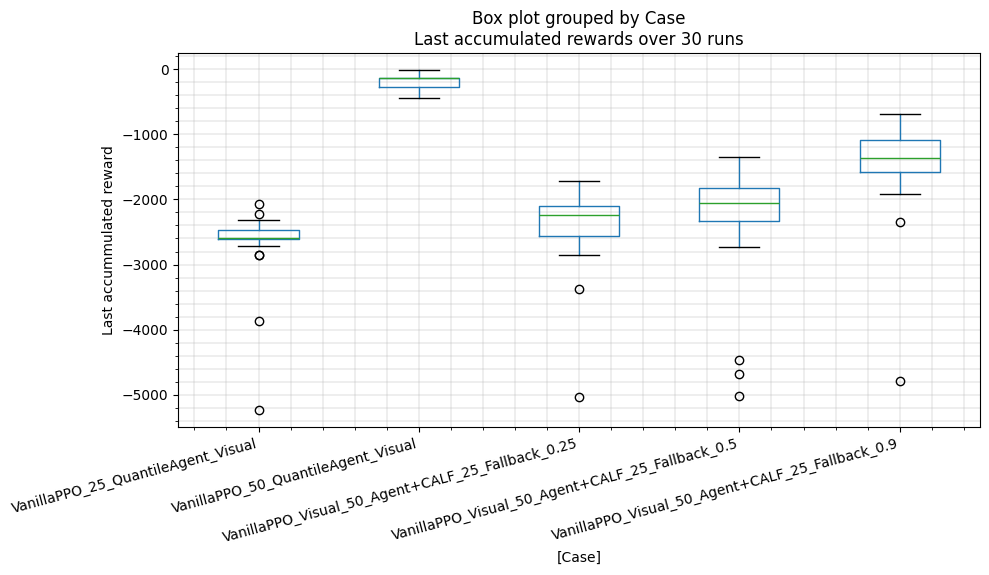

# Visual PPO with CALFWrapper evaluation

> **IMPORTANT:**  
> Ensure this subfolder is your working directory. Navigate to it by running:  
> `cd run/ppo_vispendulum_self_boost`

## Idea

This project explores training a **PPO agent** using the **Pendulum environment**, where observations are stacks of RGB images. The trained agent is then evaluated using the **CALFWrapper**.

- **PPO Agent**: A partially trained checkpoint.
- **CALF Fallback**: An earlier checkpoint of the same PPO model, trained for fewer steps.

For instance:
- `PPO agent`: Step 20.
- `CALF fallback`: Step 15.

The aim is to investigate if **CALF** can improve the performance of later checkpoints using earlier checkpoints as fallback.

### Example Checkpoints Used
- `PPO Agent`: Step **65536** (~50% of training).
- `CALF Fallback`: Step **32768** (~25% of training).

---

## Aim

To assess whether **CALF** boosts performance by:
1. Using earlier checkpoints as a fallback.
2. Comparing the performance with and without CALFWrapper.

---

## CALFWrapper Modifications

**CALFWrapperSingleVecEnv** + **RelaxProbLinear** are adapted for:
- Vectorized environments like `VecStackFrame` and `VecTranspose`.
- Under-trained checkpoints requiring more frequent fallback activation.
- A linear decay mechanism for the **Relax Probability**, which decreases to 0 during evaluation.

---

## Training and Evaluation Steps
### 1. Train PPO (Pendulum Environment)
Train a PPO agent using normalized rewards and observations (`--normalize` is `True` as default). Use the following command:  

```bash
python ppo_vispendulum.py 
```

##### Training Checkpoints

- Checkpoints saved every 16384 steps:
```
./artifacts/checkpoints/ppo_vispendulum_<step-number>_steps.zip
```
- Best checkpoint saved at:
```
./artifacts/checkpoints/ppo_vispendulum_16384_steps.zip 
```
- Normalized information 
```
./artifacts/checkpoints/vecnormalize_stats.pkl 
```

##### Configurations

The following configuration was used:

```python
total_timesteps = 131072
episode_timesteps = 1024
image_height = 64
image_width = 64
save_model_every_steps = 8192 / 4
n_steps = 1024
parallel_envs = 8

# Define the hyperparameters for PPO
ppo_hyperparams = {
    "learning_rate": 4e-4,
    "n_steps": n_steps,
    "batch_size": 512,
    "gamma": 0.99,
    "gae_lambda": 0.9,
    "clip_range": 0.2,
}
```

### Evaluation2. Evaluate PPO with CALFWrapper
> [!IMPORTANT]  
> Please notice that the evaluation should be run only after the proposed training step completed.
> The training process uses: `python ppo_vispendulum.py`

#### Basic Evaluation Command
NOTICE: `--fallback-checkpoint` and `--eval-checkpoint` have to be defined in this step.

Evaluate the trained agent with or without CALFWrapper using these commands:

- **Without CALFWrapper:**
```shell
python ppo_vispendulum.py --notrain \
    --eval-checkpoint "./artifacts/checkpoints/ppo_vispendulum_65536_steps.zip" \
    --eval-name "agent_50" \
    --log
```

- **With CALFWrapper:**

```shell
python ppo_vispendulum_eval_calf_wrapper.py \
    --calf-init-relax 0.5 \
    --calf-decay-rate 0.01 \
    --fallback-checkpoint "./artifacts/checkpoints/ppo_vispendulum_32768_steps.zip" \
    --eval-checkpoint "./artifacts/checkpoints/ppo_vispendulum_65536_steps.zip" \
    --log
```

**CALF Configuration**
```python
calf_hyperparams = {
    "calf_decay_rate": 0.01,
    "initial_relax_prob": 0.5,
}
```

#### Evaluation scripts
Run all evaluations automatically:
```shell
source evaluation_visual.sh
```
Run with additional seeds and configurations:
```shell
source evaluation_visual_loop.sh
```

##### Logs
If `--log` option is enabled, the logging files are stored in the "logs" folder. Their names are combined by "\<prefix>_\<subfix>_seed\_{seed_number}.csv".
Where:
- prefix: determined inside each launch file.
- subfix: determined by users using `--eval-name` option.
- seed_number: a random seed for the initial condition.

#### Options

**General Options**

| Option                                      | Description                                                                                                  | Default Value |
|---------------------------------------------|--------------------------------------------------------------------------------------------------------------|---------------|
| `-h`, `--help`                              | Show this help message and exit.                                                                             |               |
| `--notrain`, `--no-notrain`                 | Skip training and only run evaluation.                                                                       | False         |
| `--console`, `--no-console`                 | Disable graphical output for console-only mode.                                                              | False         |
| `--normalize`, `--no-normalize`             | Enable observation and reward normalization.                                                                 | True          |
| `--eval-normalize`, `--no-eval-normalize`   | Enable observation and reward normalization for evaluation.                                                  | False         |
| `--single-thread`, `--no-single-thread`     | Use `DummyVecEnv` for single-threaded environment.                                                           | False         |
| `--loadstep None or INT`                     | Choose checkpoint step to load for PPO agent. If `eval_checkpoint` and `loadstep` are None, the best checkpoint will be loaded.                                                                            | None          |
| `--log`, `--no-log`                         | Enable logging of simulation data.                                                                           | False         |
| `--debug`, `--no-debug`                     | Enable printing of simulation data.                                                                          | False         |
| `--seed INT`                                | Choose random seed for environmental initial state.                                                          | 42            |
| `--eval-checkpoint None or STR`              | Choose checkpoint to load for PPO agent. If `eval_checkpoint` and `loadstep` are None, the best checkpoint will be loaded.            | None          |
| `--eval-name STR`                           | Choose experimental name for logging.                                                                        | default       |
| `--calf-fallback-checkpoint None or STR`     | Choose checkpoint to load for CALF fallback (required).                                                      |               |
| `--calf-init-relax None or FLOAT`            | Choose initial relax probability.                                                                            | 0.5           |
| `--calf-decay-rate None or FLOAT`            | Choose CALF decay rate.                                                                                      | 0.01          |


**PPO Hyperparameters**

| Hyperparameter               | Description                                                                                                  | Default Value |
|------------------------------|--------------------------------------------------------------------------------------------------------------|---------------|
| `--ppo.learning-rate FLOAT`  | Step size used to update the policy network. Lower values can make learning more stable.                     | 0.0004        |
| `--ppo.n-steps INT`          | Number of steps to collect before performing a policy update. Larger values may lead to more stable updates. | 1024          |
| `--ppo.batch-size INT`       | Number of samples used in each update. Smaller values can lead to higher variance, larger values stabilize learning. | 512     |
| `--ppo.gamma FLOAT`          | Discount factor for future rewards. Closer to 1 means the agent places more emphasis on long-term rewards.   | 0.99          |
| `--ppo.gae-lambda FLOAT`     | Generalized Advantage Estimation (GAE) parameter. Balances bias vs. variance; lower values favor bias.       | 0.9           |
| `--ppo.clip-range FLOAT`     | Clipping range for the PPO objective to prevent large policy updates. Keeps updates more conservative.       | 0.2           |

### 3. Monitoring

Use MLFlow to monitor the evaluation.
Run the following command in the project directory:
```
mlflow ui
```

The name of each experiment is formed by "<lauch_file_name>_<_subfix_>". Where `subfix`, may stand for the experimental version, needs to be changed in the python scripts.

**Key Variables**

Variable | Description |
| ----- |  ----- |
| `calf/calf_decay_count` | Total CALF activations due to condition satisfaction. |
| `calf/calf_activated_count` | Total CALF activations including Relax Probability firings. |
| `calf/last_relax_prob` | Relax Probability over evaluation steps. |
| `calf/init_relax_prob` | Initial Relax Probability value. |


### 4. Results
All the results are calculated using the [Jupyter Notebook](../../analysis/ppo_vispendulum_self_boost/visual_analysis.ipynb) 

| Case                                             |   ('last_accumulated_reward', 'std') |   ('last_accumulated_reward', 'var') |   ('last_accumulated_reward', 'min') |   ('last_accumulated_reward', 'mean') |   ('last_accumulated_reward', 'median') |   ('last_accumulated_reward', 'max') |
|:-------------------------------------------------|-------------------------------------:|-------------------------------------:|-------------------------------------:|--------------------------------------:|----------------------------------------:|-------------------------------------:|
| VanillaPPO_25_QuantileAgent_Visual               |                              571.752 |                             326900   |                            -5238.11  |                             -2657.07  |                               -2588.13  |                           -2076.04   |
| VanillaPPO_50_QuantileAgent_Visual               |                              126.733 |                              16061.3 |                             -438.574 |                              -185.253 |                                -136.996 |                             -11.8081 |
| VanillaPPO_Visual_50_Agent+CALF_25_Fallback_0.25 |                              604.743 |                             365714   |                            -5032.39  |                             -2397.21  |                               -2239.08  |                           -1712.15   |
| VanillaPPO_Visual_50_Agent+CALF_25_Fallback_0.5  |                              870.613 |                             757968   |                            -5028.6   |                             -2304.5   |                               -2055.79  |                           -1345.2    |
| VanillaPPO_Visual_50_Agent+CALF_25_Fallback_0.9  |                              711.288 |                             505930   |                            -4783.17  |                             -1487.83  |                               -1355.4   |                            -679.703  |



